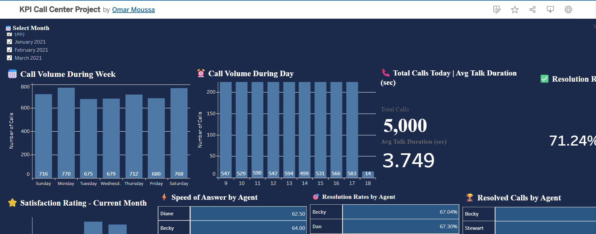

# 📊 Call Center KPI Dashboard

## Overview
An interactive KPI dashboard built with Tableau Public analyzing 
call center performance metrics.

## 🔗 Live Dashboard
[View on Tableau Public]((https://public.tableau.com/app/profile/omar.moussa5835/viz/KPICallCenterProject/Dashboard1))

## 📸 Dashboard Preview

## 📋 Dataset
- 5,000 call records
- Date range: 2021
- Fields: Agent, Date, Time, Topic, Resolved, 
  Speed of Answer, Talk Duration, Satisfaction Rating

## 📈 KPIs Tracked
- Total Calls Today
- Resolution Rate
- Avg Talk Duration
- Call Volume by Day & Hour
- Agent Performance (Resolution Rate, Speed, Resolved Calls)
- Customer Satisfaction Rating

## 🛠️ Tools Used
- Microsoft Excel (Data Source)
- Tableau Public (Visualization)

## 👤 Author
Omar Moussa
